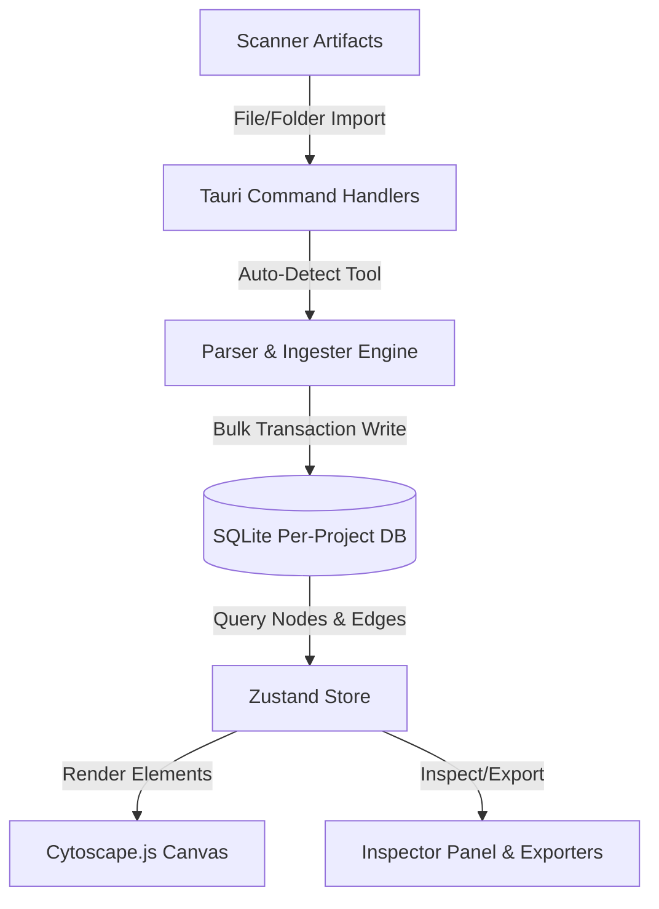

# Argus - Visual Web Attack-Surface Explorer

Argus is a desktop-based **Visual Web Attack-Surface Explorer** designed for security engineers, penetration testers, and bug hunters. It aggregates data from multiple reconnaissance and vulnerability scanners, parsing them into an interactive, unified dependency graph. It allows users to visually map subdomains, open ports, web endpoints, technologies, and vulnerabilities, and track changes in target infrastructure over time.

---

## 1. High-Level Concept

Security reconnaissance typically involves running many decoupled command-line interface (CLI) tools (e.g., `subfinder`, `httpx`, `nuclei`, `nmap`). Consuming their outputs (which range from raw text files, JSON lines, to XML files) and understanding the overall architecture of a target can be challenging.

Argus solves this by:
1. **Aggregating Tool Output**: Ingesting files or folders directly and auto-detecting the originating tool.
2. **Normalizing & Relating Data**: Mapping hosts, IPs, open ports, endpoints, active technologies, and findings into structured graph nodes.
3. **Interactive Graph Visualization**: Rendering connections dynamically using custom cytoscape.js layouts.
4. **Vulnerability & Asset Rollup**: Propagating critical security findings and asset density upwards through the DNS hierarchy, highlighting high-risk targets.
5. **Scan Diffing**: Directly comparing two historical scanning sessions to isolate newly added subdomains, removed assets, or modified HTTP status codes.



---

## 2. Technical Architecture

Argus is built on the **Tauri (v2)** framework, bridging a fast, memory-safe **Rust backend** with a responsive **React 19 + TypeScript frontend**.

### 2.1 Backend (Rust)
* **Tauri Core**: Manages native shell access (to open links in browsers), local file dialogues (`tauri-plugin-dialog`), logging, and system windows.
* **SQLite & SQLx**: To preserve data isolation and portability, Argus uses a **database-per-project** strategy. Each project is saved as a separate `<project_id>.argus` file in the user's data directory. Database schema migrations are bundled inside the binary and executed automatically on project creation/opening via `sqlx::migrate!`.
* **Async & Multi-Threading**: Offloads heavy workloads (e.g., parsing massive scanner logs, computing graph diffs) to background threads using `tokio::task::spawn_blocking`.

### 2.2 Frontend (React + TS + Vite)
* **Build System**: React 19 compiled via Vite for Hot Module Replacement (HMR) and rapid startup.
* **State Management**: Zustand handles single-source-of-truth states, project selectors, filter criteria, active layouts, and communication with Tauri IPC commands.
* **Graph Engine**: Cytoscape.js is configured with force-directed (`cytoscape-cola`) and hierarchical tree (`cytoscape-dagre`) layouts, utilizing canvas styles for interactive feedback:
  * **Status Code Color-Coding**: Visualizes response status on subdomains (2xx = Green, 3xx = Yellow, 4xx = Orange, 5xx = Red).
  * **Highlighting**: Hovering over a node dims unrelated elements and highlights its neighbors.
  * **Badge Overlays**: In diffing mode, added nodes get `[+]` badges with green borders, while removed ones show `[-]` with dimmed backgrounds.

---

## 3. Database Schema Design

Argus stores its local project databases under the user app data directory (e.g., `%APPDATA%/Argus` on Windows). The schema is optimized for graph queries and security rollups:

```sql
-- Projects & Graphs
CREATE TABLE IF NOT EXISTS projects (
    id TEXT PRIMARY KEY,
    name TEXT NOT NULL,
    root_domain TEXT NOT NULL,
    schema_version INTEGER NOT NULL DEFAULT 1,
    created_at TEXT NOT NULL,
    updated_at TEXT NOT NULL
);

CREATE TABLE IF NOT EXISTS graphs (
    id TEXT PRIMARY KEY,
    project_id TEXT NOT NULL,
    name TEXT NOT NULL,
    root_domain TEXT NOT NULL,
    source_scan_label TEXT NOT NULL,
    node_count INTEGER NOT NULL DEFAULT 0,
    edge_count INTEGER NOT NULL DEFAULT 0,
    created_at TEXT NOT NULL,
    FOREIGN KEY(project_id) REFERENCES projects(id) ON DELETE CASCADE
);

-- Nodes & Edges (The Core Graph)
CREATE TABLE IF NOT EXISTS nodes (
    id TEXT PRIMARY KEY,
    graph_id TEXT NOT NULL,
    type TEXT NOT NULL, -- 'root' | 'subdomain' | 'endpoint' | 'ip' | 'technology' | 'finding' | 'jsfile' | 'port'
    label TEXT NOT NULL,
    status_code INTEGER,
    ip TEXT,
    cdn TEXT,
    title TEXT,
    page_size INTEGER,
    found_by TEXT,
    score REAL NOT NULL DEFAULT 0.0,
    is_favorite INTEGER NOT NULL DEFAULT 0,
    is_pinned INTEGER NOT NULL DEFAULT 0,
    is_collapsed INTEGER NOT NULL DEFAULT 0,
    parent_id TEXT,
    pos_x REAL,
    pos_y REAL,
    created_at TEXT NOT NULL,
    FOREIGN KEY(graph_id) REFERENCES graphs(id) ON DELETE CASCADE
);

CREATE TABLE IF NOT EXISTS edges (
    id TEXT PRIMARY KEY,
    graph_id TEXT NOT NULL,
    source_node_id TEXT NOT NULL,
    target_node_id TEXT NOT NULL,
    relation TEXT NOT NULL, -- 'subdomain_of' | 'uses_tech' | 'has_endpoint' | 'has_finding' | 'resolves_to' | 'has_port'
    FOREIGN KEY(graph_id) REFERENCES graphs(id) ON DELETE CASCADE,
    FOREIGN KEY(source_node_id) REFERENCES nodes(id) ON DELETE CASCADE,
    FOREIGN KEY(target_node_id) REFERENCES nodes(id) ON DELETE CASCADE
);

-- Extra Metadata
CREATE TABLE IF NOT EXISTS findings (
    id TEXT PRIMARY KEY,
    node_id TEXT NOT NULL,
    severity TEXT NOT NULL, -- 'critical' | 'high' | 'medium' | 'low' | 'info'
    title TEXT NOT NULL,
    description TEXT NOT NULL,
    source_tool TEXT NOT NULL,
    created_at TEXT NOT NULL,
    FOREIGN KEY(node_id) REFERENCES nodes(id) ON DELETE CASCADE
);

CREATE TABLE IF NOT EXISTS tags (
    id TEXT PRIMARY KEY,
    node_id TEXT NOT NULL,
    label TEXT NOT NULL,
    FOREIGN KEY(node_id) REFERENCES nodes(id) ON DELETE CASCADE
);

CREATE TABLE IF NOT EXISTS notes (
    id TEXT PRIMARY KEY,
    node_id TEXT NOT NULL UNIQUE,
    body TEXT NOT NULL,
    updated_at TEXT NOT NULL,
    FOREIGN KEY(node_id) REFERENCES nodes(id) ON DELETE CASCADE
);
```

### Key Indexes for Performance
```sql
CREATE INDEX IF NOT EXISTS idx_nodes_graph_id ON nodes(graph_id);
CREATE INDEX IF NOT EXISTS idx_nodes_type ON nodes(type);
CREATE INDEX IF NOT EXISTS idx_nodes_label ON nodes(label);
CREATE INDEX IF NOT EXISTS idx_edges_graph_id ON edges(graph_id);
CREATE INDEX IF NOT EXISTS idx_findings_node_id ON findings(node_id);
```

---

## 4. Parser & Importer Strategy

The core backend file parser (`src-tauri/src/commands/import.rs`) features robust heuristics and tools:

### 4.1 Auto-Detection Flow
If the user selects `Auto` when dropping recon files, the backend scans the file extension or samples the initial 30 lines:
* **XML Header** (`<nmaprun ...>`): Identifies **Nmap**.
* **JSON Line Structure**:
  * Contains `template-id` / `matched-at`: Identifies **Nuclei**.
  * Contains `status_code` / `cdn_name` / `tech`: Identifies **Httpx**.
  * Contains `request.endpoint` / `endpoint`: Identifies **Katana**.
  * Contains `subdomain` / `host`: Identifies **Subfinder**.
* **File Extension** (`.js`): Identifies **JavaScript Asset Extractors**.
* **Fallback**: Parses as list of subdomains (**Subfinder** raw text).

### 4.2 Ingestion & Graph Mapping
When a record is parsed, it is processed via a SQLite transaction:
1. **Subdomains**: Checks if the hostname already exists in the graph. If not, it creates a new `subdomain` node, sets the default scoring, and builds an edge connecting it to the `root` node (`subdomain_of`).
2. **HTTP Metadata (httpx)**: Updates the existing subdomain node with the status code, page title, HTML content-size, IP, and CDN name.
3. **Technologies**: If Httpx lists technologies (e.g., React, Cloudflare, Nginx), the parser creates or resolves a `technology` node for each, and maps an edge (`uses_tech`) linking the subdomain to that technology.
4. **Endpoints (katana / gau)**: Maps web URL paths to `endpoint` nodes. The parent subdomain is extracted to link the endpoint to the subdomain via `has_endpoint`.
5. **Vulnerabilities (nuclei)**: Creates a `finding` node detailing severity, name, and description. It connects it via `has_finding` to the matching subdomain or endpoint node.
6. **Port Scans (nmap)**: Parses open ports, service protocols, and software products, creating `port` nodes and linking them to host IP nodes.

---

## 5. Algorithmic Highlights

### 5.1 Smart Subdomain Tree Auto-Collapsing
To prevent browser canvas lag on massive scans, the system calculates densities. If a query yields **more than 300 visible nodes**:
* Subdomain branches are automatically collapsed (`is_collapsed = 1`).
* **Vulnerability Rollup**: A recursive SQLite query calculates the highest severity vulnerability (`critical` -> `high` -> `medium` -> `low` -> `info`) residing under a collapsed subdomain's endpoints or ports:
  ```sql
  SELECT f.severity FROM findings f 
  JOIN nodes n ON f.node_id = n.id 
  WHERE n.parent_id = ? OR n.id = ? 
  ORDER BY CASE f.severity 
    WHEN 'critical' THEN 1 
    WHEN 'high' THEN 2 
    WHEN 'medium' THEN 3 
    WHEN 'low' THEN 4 
    ELSE 5 END ASC LIMIT 1
  ```
* Displays a rollup count of total hidden descendants so the user can easily see which node holds hidden active surface or critical bugs.
* Endpoints are excluded from the main canvas by default (unless marked as favorite) to keep layouts readable, yet are browsable in the scope inspector.

### 5.2 Concurrent Graph Diffing
Comparing two scanners over time is vital to catch new infrastructure.
The Rust command `graph_diff` reads nodes from Graph A and Graph B:
1. It spawns a thread-blocking task via `tokio::task::spawn_blocking`.
2. It maps Graph A's labels and Graph B's labels into two separate `HashMap` indexes.
3. It iterates over Graph B:
   * If a label is not in Graph A, it's flagged as `added`.
   * If a label exists but the status code changed, it's flagged as `changed`.
4. It iterates over Graph A:
   * If a label is not in Graph B, it's flagged as `removed`.
5. Return results to the UI, enabling **Diff Mode**, which overlays green additions and dimmed/slashed removals.

---

## 6. How It Was Built & Developed

### 6.1 Backend Dependencies (`Cargo.toml`)
* `tauri` (v2): Desktop webview architecture.
* `sqlx` (with `runtime-tokio`, `sqlite` and `migrate` features): Asynchronous database management.
* `tokio`: Full async scheduler.
* `csv` & `serde`/`serde_json`: High-speed parsing of CSV tables and JSON lines.
* `regex`: High-efficiency string extraction for JS files and unstructured formats.
* `dirs` & `uuid` & `chrono`: Local OS pathing, globally unique IDs, and standardized ISO timestamps.

### 6.2 Frontend Dependencies (`package.json`)
* `@tauri-apps/api` & `@tauri-apps/plugin-dialog` & `@tauri-apps/plugin-shell`: Frontend-to-Backend IPC.
* `react` (v19) & `react-dom`: Dynamic user interfaces.
* `cytoscape` & `cytoscape-cola` & `cytoscape-dagre`: Mathematical canvas layouts.
* `zustand`: Ultra-lightweight reactive global state management.
* `clsx`: Utility for combining CSS class names.

### 6.3 Global Key Bindings & Shortcuts
Argus includes quick-key listeners bound globally in `src/App.tsx`:
* **`Ctrl + B`**: Toggle Left Control Station (Station).
* **`Ctrl + J`**: Toggle Right Scope Inspector (Scope).
* **`Ctrl + L`**: Toggle Bottom Command/Status Bar (Command Bar).
* **`Ctrl + M`**: Toggle Minimap.
* **`Ctrl + G`**: Toggle Canvas Layout Grid.
* **`Ctrl + P`**: Open Fuzzy Search Modal.
* **`Ctrl + D`**: Open Scan Version Comparison.
* **`Ctrl + ?`**: Show Help/Shortcuts Overlay.
* **`1` / `2` / `3` / `4` / `5`**: Cycle Layouts (Cola, Tree, Circle, Grid, Manual).
* **`Escape`**: Close modals, clear query filters, and exit Diff Mode.

---

## 7. Recent Core Enhancements & Optimization Upgrades

### 7.1 Custom Frameless VS Code-Style Title Bar
To provide a native desktop look and feel, the application window decorations are customized:
* **Frameless Design**: System-native title bars and window borders are disabled (`"decorations": false` in `tauri.conf.json`).
* **Title Bar Consolidation**: A custom `30px` title bar is rendered in React, containing the Argus logo, dropdown menus, document title in the center, and Windows-style minimize (`⎯`), toggle maximize (`☐`/`❐`), and close (`×`) controls.
* **Window Dragging**: A center drag region uses an imperative `onMouseDown` handler calling `getCurrentWindow().startDragging()` alongside `data-tauri-drag-region` for smooth, reliable dragging.
* **Tauri ACL Authorization**: Added window control actions permissions (`core:window:allow-close`, `core:window:allow-minimize`, `core:window:allow-maximize`, etc.) to the capabilities list.

### 7.2 High-Performance Scaling (Up to 5 Lakhs Nodes)
To handle enterprise-scale reconnaissance graphs (up to 500,000 nodes):
* **Single Window Queries**: Replaced O(N) database queries in `graph_get_nodes` with 2 bulk aggregated SQLite queries, reducing database-to-memory roundtrips from 62,000 to just 2.
* **IPC Payload Optimization**: Pre-filters endpoints and JS files directly in backend memory (using SQLite joins in `graph_get_edges`), reducing IPC payload size from over 100MB to under 1MB.
* **Canvas Limit Pruning**: Automatically caps visual nodes rendered on the canvas at 3,000 items, prioritizing root domains, favorites, findings, and high-scoring nodes. Excluded endpoint/JS files are fully browseable under the selected subdomain's Inspector panel.

### 7.3 Interactive Pan-and-Zoom Minimap
* Replaced static placeholders with a high-fidelity 2D canvas minimap overlaying the bottom-right corner.
* Dynamically mirrors node positions and status colors, and draws a translucent blue bounding box representing the visible viewport.
* Supports active drag-to-pan, letting the user center the Cytoscape canvas by clicking and dragging on the minimap interface.

### 7.4 Focus Loss & Browser Interference Safeguards
* **Global Context Menu Disabling**: Prevented browser right-click context menus (`e.preventDefault()` on global `contextmenu` events) to protect desktop looks. Custom node context menus remain fully active.
* **WebView2 Focus Refocusing**: Attaches `document.body.focus()` to pane toggle events to prevent WebView2 focus loss, making global shortcuts like `Ctrl+J` highly stable.

